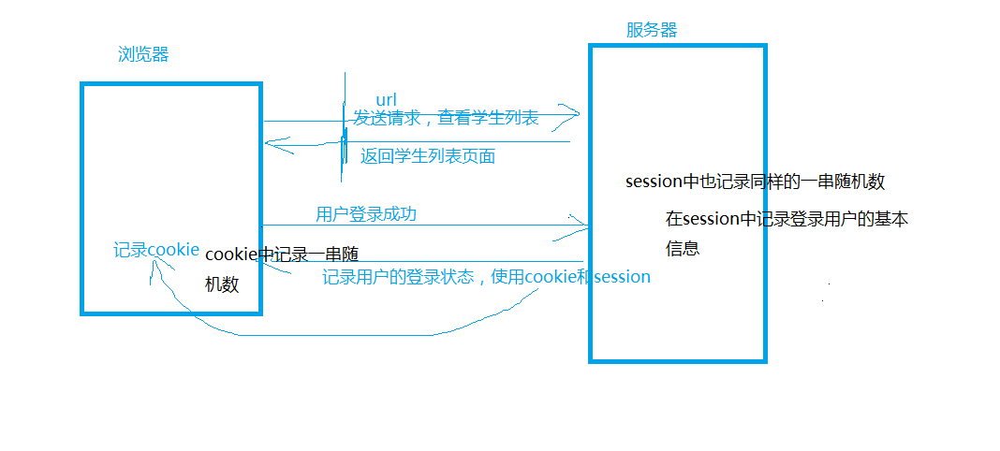
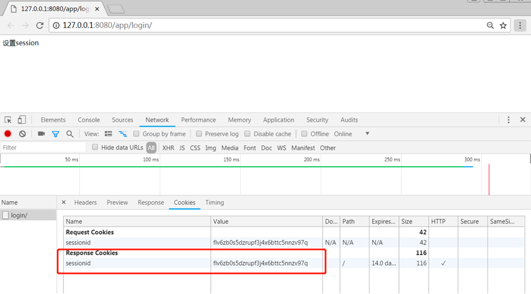

# 视图2使用指南

回话技术,比如在做登录功能的时候，需要配合是用存储在客户端的cookie信息，以及存储在服务端的session来实现登录功能。
在cookie中保存了用户的信息，特别是一个特殊的令牌信息，当用户拿着这个特殊的令牌来访问网站的时候，网站会从cookie中
获取这个特殊令牌去数据库session中去查询是否有这个对应的令牌的信息，如果有则验证成功，就可以把用户的信息返回给客户端
了，如果验证失败则提示用户没有登录等等提示信息。


cookie不属于http协议范围，由于http协议无法保持状态，但实际情况，我们却又需要“保持状态”，因此cookie就是在这样一个场景下诞生。

cookie的工作原理是：由服务器产生内容，浏览器收到请求后保存在本地；当浏览器再次访问时，浏览器会自动带上cookie，这样服务器就能通过cookie的内容来判断这个是“谁”了。

cookie虽然在一定程度上解决了“保持状态”的需求，但是由于cookie本身最大支持4096字节，以及cookie本身保存在客户端，可能被拦截或窃取，因此就需要有一种新的东西，它能支持更多的字节，并且他保存在服务器，有较高的安全性。这就是session。

问题来了，基于http协议的无状态特征，服务器根本就不知道访问者是“谁”。那么上述的cookie就起到桥接的作用。

我们可以给每个客户端的cookie分配一个唯一的id，这样用户在访问时，通过cookie，服务器就知道来的人是“谁”。然后我们再根据不同的cookie的id，在服务器上保存一段时间的私密资料，如“账号密码”等等。

总结而言：cookie弥补了http无状态的不足，让服务器知道来的人是“谁”；但是cookie以文本的形式保存在本地，自身安全性较差；所以我们就通过cookie识别不同的用户，对应的在session里保存私密的信息以及超过4096字节的文本。

另外，上述所说的cookie和session其实是共通性的东西，不限于语言和框架

#### 1. cookie

HTTP 协议是无状态的。因此，若不借助其他手段，远程的服务器就无法知道以前和客户端做了哪些通信。Cookie 就是「其他手段」之一。 Cookie 一个典型的应用场景，就是用于记录用户在网站上的登录状态。

用户登录成功后，服务器下发一个（通常是加密了的）Cookie 文件。
客户端（通常是网页浏览器）将收到的 Cookie 文件保存起来。
下次客户端与服务器连接时，将 Cookie 文件发送给服务器，由服务器校验其含义，恢复登录状态（从而避免再次登录）。

##### 1.1 描述
```
浏览器端的回话技术
cookie本身由浏览器生成，通过Response将cookie写在浏览器上，下一次访问，浏览器会根据不同的规则携带cookie过来
```
##### 1.2 cookie方法

    设置：response.set_cookie(key, value, max_age=None, exprise=None)
    
    获取：request.GET.get(key)
    
    删除：request.delete_cookie(key)

注意：cookie不能跨浏览器

参数定义：
	
max_age和exprise时间：

    max_age :  整数，指定cookie过期时间，以秒为单位
    
    exprise： 整数，指定过期时间，还支持是一个datetime或者timedelta，可以指定一个具体日期时间


​    
设置10天后过期：

    exprise=datetime.datetime.now() + timedelta(days=10) 10天后过期

永不过期：

    exprise设置为None表示为永不过期


#### 2. session

##### 2.1 描述
    服务端会话技术，依赖于cookie

##### 2.2 开启session设置

1）django中启用SESSION

在settings中修改如下地方

    INSTALLED_APPS:
        ‘django.contrib.sessions’
    
    MIDDLEWARE:
        ‘django.contrib.sessions.middleware.SessionMiddleware’

每个HttpResponse对象都有一个session属性，也是一个类字典对象


##### 2.3 常用操作

	request.session[‘user’] = username 设置数据
	
	request.session.get(key, default=None) 根据键获取会话的值
	
	request.session.flush() 删除当前的会话数据并删除会话的cookie，django.contrib.auth.logout() 函数中就会调用它。
	
	request.session.session_key  获取sessionid值
	
	request.session.delete(request.session.session_key) 删除当前用户的所有Session数据
	
	del request.session['key'] 删除session中的key值
	
	request.session.set_expiry(value)
		如果value是个整数，session会在些秒数后失效
		如果value是个datatime或timedelta，session就会在这个时间后失效。 
		如果value是0,用户关闭浏览器session就会失效。


	数据存储到数据库中会进行编码使用的是base64

代码如下：

	from django.http import HttpResponseRedirect
	from django.shortcuts import render
	from django.urls import reverse


​	
	def index(request):
	    if request.method == 'GET':
	        username = request.session.get('username')
	        # username = request.session['username']
	        print(username)
	        # 获取session_key
	        session_key = request.session.session_key
	        print(session_key)
	        # 删除session整条记录
	        request.session.delete(session_key)
	        # 删除session中的数据
	        del request.session['username']
	        username = request.session.get('username')
	        print(username)
			# 设置session过期时间
	        from datetime import timedelta
	        # request.session.set_expiry(timedelta(days=4))
	        request.session.set_expiry(600)
	        return render(request, 'index.html')


​	
	def setCookie(request):
	    if request.method == 'GET':
	        res = HttpResponseRedirect(reverse('myapp:index'))
	        # 设置cookie值
	        # set_cookie(key, value, max_age, expires)
	
	        # 删除：delete_cookie(key)  set_cookie(key, value, max_age=0)
	        # res.set_cookie('session_id', '12t861ihafiagdfi', max_age=3)
	        # res.delete_cookie('session_id')
	
	        # 设置cookie中的值，并且设置session中的值
	        # 登录的时候，进行验证用户的用户名和密码是否正确，如果正确
	        request.session['login'] = True
	        request.session['username'] = '张三'
	        request.session['password'] = '123456'
	        return res


注意:

如果使用set_expiry(value)设置失效时间，value为整数，表示value秒后失效。如果value为time类型的话，则需要在settings.py中添加如下配置，将时间进行PickleSerilizer序列化。

	SESSION_SERIALIZER = 'django.contrib.sessions.serializers.PickleSerializer'


实现原理：



存储值原理图：


#### 3. 用户认证系统的cookies和session的工作流程：

1)	当用户使用用户名和密码进行登录认证，如果认证成功，则返回一个response响应，并绑定cookie。cookie中需设置一个键值对，键为sessionID，值为随机字符串。


	
2)	服务端以发送给客户端cookie中的随机字符串为键，用户的基本信息为值，将数据保存起来。
	


3)	当用户下次发送URL请求，服务端可以通过cookie中的随机字符串，找到在服务端中保存用户的基本信息。


