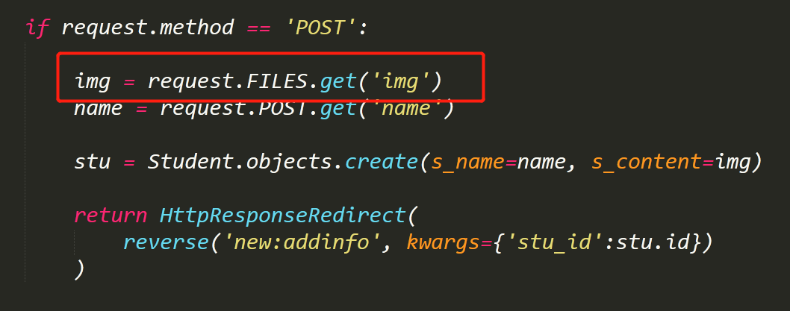

# 实现图片上传展示等操作指南

### 前言
在很多开发功能里面都涉及到需要上传图片的地方，比如头像，或者封面图，或者内容中插入图片信息等，此指南就是来简单的实现一个图片文件上传并且展示的功能演示

### 习题
题目：
1) 编写一个页面，用于提交数据，包括用户的名称，和头像图片
2) 编写一个方法，用户保存页面提交的用户名称和图片信息，将图片保存到指定的文件夹中
3）配置静态页面解析，在页面中展示出上传图片

#### 0. 安装处理图片的库
	pip install Pillow

#### 1. 修改配置信息
在工程目录中，修改setting.py文件，在最后面加入一下配置信息：

在urls.py文件中加入信息
	urlpatterns += static(settings.MEDIA_URL, document_root=settings.MEDIA_ROOT)

#### 2. 定义模型
在模型中加入ImageFiled字段，并且指定上传的图片的保存路径

#### 3. 在页面中传递图片信息，和用户名信息

#### 4. 在服务端接受请求，并且保存图片信息

#### 5. 页面展示

