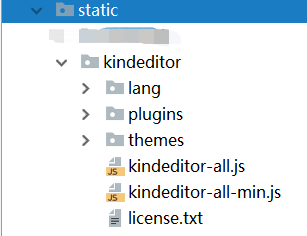
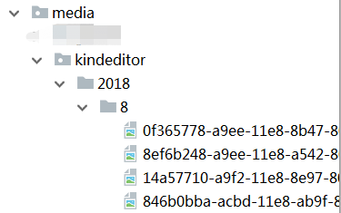

# django项目对接富文本编辑器kindeditor的使用

## 前言

在Django中经常使用富文本编辑来编辑文本内容。富文本编辑器有很多可以选择，比如baiduEditor，tinymce，kindeditor等等。在此我选择使用kindeditor富文本编辑器，KindEditor 使用 JavaScript 编写，可以无缝地与 Java、.NET、PHP、ASP 等程序集成，很适合做网站的文本编辑器来使用。

### 1. kindeditor下载与配置

下载 KindEditor 最新版本，下载之后打开 examples/index.html 就可以看到演示。

步骤1： 下载[传送门地址](http://www.kindsoft.net/down.php)

步骤2： 将下载的kindeditor解压，并删除无用的asp、jsp、php等配置文件夹。

步骤3： 将kindeditor文件夹拷贝放在static中

如：
	

### 2. Django中配置

要使用kindeditor富文本编辑器需要在settings.py文件中配置静态static解析路径，以及media文件解析路径。并且在页面中进行相关js的加载，和上传路径的指定等。
	
#### 2.1 在settings.py中配置如下参数：

	STATIC_URL = '/static/'
	# 配置static的路径
	STATICFILES_DIRS = [
	    os.path.join(BASE_DIR, 'static')
	]
	
	MEDIA_URL = '/media/'
	# 配置media的路径
	MEDIA_ROOT = os.path.join(BASE_DIR, 'media')

#### 2.2 页面中加载富文本编辑器，引入js，定义uploadJson上传地址，实例化富文本输入框

步骤1：引入js, 定义上传图片等文件的地址

	
	
	
	    文章编辑页面
	
	
	
	    
	    
	    
	    
	
	
	
	    <form action="" method="post">
	        
	        {{ msg }}
	        标题：<input type="text" name="title">
	        内容：<textarea id="editor_id" name="content"></textarea>
	        
<input type="submit" value="提交">

	    </form>
	

1) uploadJson参数为:'/util/upload/kindeditor'，该URL实现了上传文件的方法。该URL对应的视图函数，在步骤3中定义。

2) 初始化定义富文本编辑器的对象

	<textarea id="editor_id" name="content">
	
	</textarea>

步骤3：定义uploadJson实现的方法

a）在urls.py中定义处理上传文件的URL规则

在工程目录的urls.py文件中定义上传图片的配置和访问media路径的配置

	from django.urls import path, include, re_path
	from django.contrib.staticfiles.urls import static
	
	from utils.upload_image import upload_image
	
	 # kindeditor编辑器上传图片地址
	re_path(r'^util/upload/(?P<dir_name>[^/]+)$', upload_image, name='upload_image'),
	
	# 配置media访问路径
	urlpatterns += static(settings.MEDIA_URL, document_root=settings.MEDIA_ROOT)

应用app的urls.py中定义编辑和列表的方法:

	# 编辑文章
	path(r'edit_article/', views.edit_article, name='edit_article'),
	# 文章列表
	path(r'article/', views.article, name='article'),

b）在utils中定义upload_images文件，并定义upload_image函数

	# -*- coding: utf-8 -*-
	from django.http import HttpResponse
	from django.conf import settings
	from django.views.decorators.csrf import csrf_exempt
	import os
	import uuid
	import json
	import datetime as dt

​	
	@csrf_exempt
	def upload_image(request, dir_name):
	    ##################
	    #  kindeditor图片上传返回数据格式说明：
	    # {"error": 1, "message": "出错信息"}
	    # {"error": 0, "url": "图片地址"}
	    ##################
	    result = {"error": 1, "message": "上传出错"}
	    files = request.FILES.get("imgFile", None)
	    if files:
	        result =image_upload(files, dir_name)
	    return HttpResponse(json.dumps(result), content_type="application/json")

​	
	#目录创建
	def upload_generation_dir(dir_name):
	    today = dt.datetime.today()
	    dir_name = dir_name + '/%d/%d/' %(today.year,today.month)
	    if not os.path.exists(settings.MEDIA_ROOT + dir_name):
	        os.makedirs(settings.MEDIA_ROOT + dir_name)
	    return dir_name
	
	# 图片上传
	def image_upload(files, dir_name):
	    #允许上传文件类型
	    allow_suffix =['jpg', 'png', 'jpeg', 'gif', 'bmp']
	    file_suffix = files.name.split(".")[-1]
	    if file_suffix not in allow_suffix:
	        return {"error": 1, "message": "图片格式不正确"}
	    relative_path_file = upload_generation_dir(dir_name)
	    path=os.path.join(settings.MEDIA_ROOT, relative_path_file)
	    if not os.path.exists(path): #如果目录不存在创建目录
	        os.makedirs(path)
	    file_name=str(uuid.uuid1())+"."+file_suffix
	    path_file=os.path.join(path, file_name)
	    file_url = settings.MEDIA_URL + relative_path_file + file_name
	    open(path_file, 'wb').write(files.file.read()) # 保存图片
	    return {"error": 0, "url": file_url}

步骤4：实现编辑上传功能

	def edit_article(request):
	    """
	    文章编辑方法
	    """
	    if request.method == 'GET':
	        return render(request, 'edit.html')
	    if request.method == 'POST':
	        # 获取文章的标题和内容
	        title = request.POST.get('title')
	        content = request.POST.get('content')
	        # 使用all()方法进行判断，如果文章标题和内容任何一个参数没有填写，则返回错误信息
	        if not all([title, content]):
	            msg = '请填写完整的参数'
	            return render(request, 'edit.html', {'msg': msg})
	        # 创建文章
	        Article.objects.create(title=title,
	                               content=content)
	        # 创建文章成功后，跳转到文章列表页面
	        return HttpResponseRedirect(reverse('users:article'))
	
	def article(request):
	"""
	文章展示方法
	"""
	if request.method == 'GET':
	    # 获取所有的文章
	    articles = Article.objects.all()
	    return render(request, 'article.html', {'articles': articles})

### 3. 文件上传media文件中的展示

