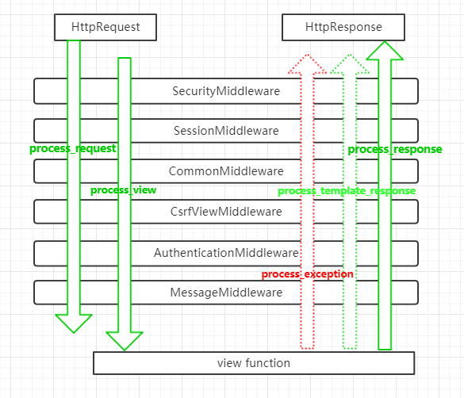

## Django中间件的执行流程 

当请求到达中间件以后，先按照正序执行每个注册中间件的process_request方法，process_request方法返回的值是None，就依次执行。

如果返回的值是HttpResponse对象，不再执行后面的process_request方法，而是执行当前对应中间件的process_response方法，将HttpResponse对象返回给浏览器。

也就说，如果MIDDLEWARE中注册了6个中间件，执行过程中，第3个中间件返回了一个HttpResponse对象，那么第4、5、6中间件的process_request和process_response方法都不执行，顺序执行3、2、1中间件的process_response方法。 

 

process_request方法都执行完后，匹配路由，找到要执行的视图函数，先不执行视图函数，先执行中间件中的process_view方法，process_view方法返回None，继续按顺序执行，所有process_view方法执行完后执行视图函数。

假如中间件3的process_view方法返回了HttpResponse对象，则4、5、6的process_view以及视图函数都不执行，直接从最后一个中间件，也就是中间件6的process_response方法开始倒序执行。

 

process_template_response和process_exception两个方法的触发是有条件的，执行顺序也是倒序。

总结所有的执行流程如下：

 