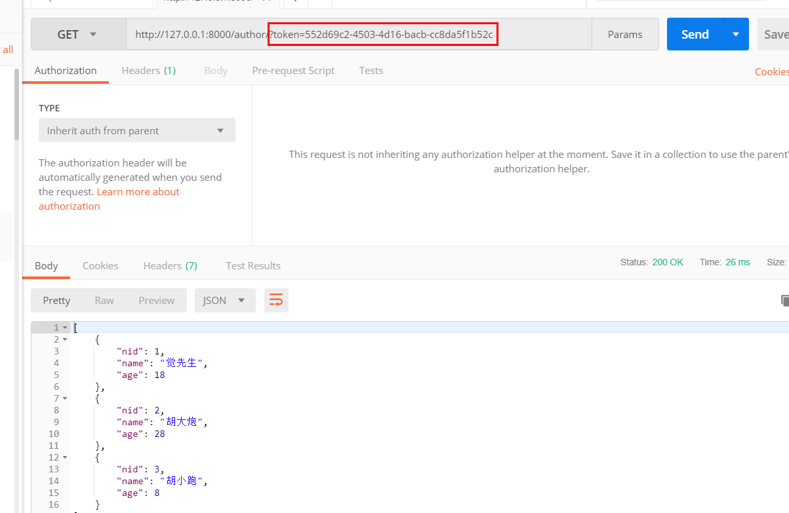

## 一，认证组件前戏准备

对于认证，我们一般有三种方式，即cookie, session,token,

- cookie,是将信息存放在客户端(浏览器上)，信息不安全；
- session,把信息放在服务器数据库中，但是要是信息量较大，对服务器的压力就会大大增加；
- token采用每次用户登陆后为其设置一个随机字符串，即token值，用户登陆之后，每次访问都带着这个token来访问，服务端只需要验证token值是否正确就可以，相对比较方便使用；

所以，我们使用token做认证；


### 1，准备user表和token表
```python
class User(models.Model):
    username = models.CharField(max_length=32)
    password = models.CharField(max_length=32)
    level = ((1, '普通'), (2, "vip"), (3, "svip"))
    user_level = models.IntegerField(choices=level)


class UserToken(models.Model):
    token = models.CharField(max_length=128)
    user = models.OneToOneField(to="User", on_delete=models.CASCADE)
```

### 2, 写一个登陆CBV视图

```python
import uuid
from app01 import models
from rest_framework.views import APIView
from rest_framework.response import Response

class Login(APIView):

    def post(self, request):
        """
        0: 用户名或者密码错误！
        1: 成功
        2：其他异常
        :param request:
        :return:
        """
        res = {"code": 0, "msg": None, "user": None}
        try:
            username = request.data.get("username")
            password = request.data.get("password")
            user_obj = models.User.objects.filter(username=username, password=password).first()
            if user_obj:
                random_str = uuid.uuid4()
                # models.UserToken.objects.create(token=random_str, user=user_obj)  # 这样是错误的，每次登陆都要去新建一条数据
                models.UserToken.objects.update_or_create(user=user_obj, defaults={"token": random_str})
                # 上面意思是： 根据user=user_obj，这个条件去筛选，如果能找到符合该条件的就更新该条数据token字段
                #              如果没找到符合条件的，就去创建一条新数据；
                res["code"] = 1
                res["msg"] = "登陆成功！"
                res["user"] = username
                res["token"] = random_str
            else:
                res["msg"] = "用户名或者密码错误！"
        except Exception as e:
            res["code"] = 2
            res["msg"] = str(e)
        return Response(res)
```

## 二，restframework认证组件源码解析

restframework框架的APIView这个类中做了很多事情，定义了as_view()方法，还定义了dispatch()方法，在**dispatch()**中对原来的django封装的**request对象进行了重新封装**，还为了我提供了**认证，权限，频率**等Hooks；

源码中得self.dispatch()：  这里得self是我们得视图类，在as_view()中的view函数中赋的值self = cls(**initkwargs)；


```
    def dispatch(self, request, *args, **kwargs):
        """
        `.dispatch()` is pretty much the same as Django's regular dispatch,
        but with extra hooks for startup, finalize, and exception handling.
        """
        self.args = args
        self.kwargs = kwargs
        # 在这里重新封装了request对象
        request = self.initialize_request(request, *args, **kwargs)
        self.request = request
        self.headers = self.default_response_headers  # deprecate?

        try:
           # 在进行路由分发执行我们相对应得请求方法之前，在这个方法中，做了认证，权限，频率， 如果在这三个组件中，任意一个没有通过，请求都会被拦截下来
            self.initial(request, *args, **kwargs)

            # Get the appropriate handler method
            if request.method.lower() in self.http_method_names:
                handler = getattr(self, request.method.lower(),
                                  self.http_method_not_allowed)
            else:
                handler = self.http_method_not_allowed

            response = handler(request, *args, **kwargs)

        except Exception as exc:
            response = self.handle_exception(exc)

        self.response = self.finalize_response(request, response, *args, **kwargs)
        return self.response     
```


继续 self.initial(): self是视图类的实例化对象

```
    def initial(self, request, *args, **kwargs):
        """
        Runs anything that needs to occur prior to calling the method handler.
        """
        self.format_kwarg = self.get_format_suffix(**kwargs)

        # Perform content negotiation and store the accepted info on the request
        neg = self.perform_content_negotiation(request)
        request.accepted_renderer, request.accepted_media_type = neg

        # Determine the API version, if versioning is in use.
        version, scheme = self.determine_version(request, *args, **kwargs)
        request.version, request.versioning_scheme = version, scheme

        # Ensure that the incoming request is permitted
        # 认证组件
        self.perform_authentication(request)
        # 权限组件
        self.check_permissions(request)
         # 频率组件
        self.check_throttles(request)
```


我们看看认证组件，self.perform_authentication(request) ： self是视图类

```
    def perform_authentication(self, request):
        request.user  # 从这里开始self就是新的request对象
```

继续： request.user： self是新的request对象

```
@property
    def user(self):
        """
        Returns the user associated with the current request, as authenticated
        by the authentication classes provided to the request.
        """
        if not hasattr(self, '_user'):
            with wrap_attributeerrors():
                self._authenticate()
        return self._user
```

继续： self._authenticate()


```
    def _authenticate(self):
        """
        Attempt to authenticate the request using each authentication instance
        in turn.
        """
        for authenticator in self.authenticators:
            try:
                user_auth_tuple = authenticator.authenticate(self)
            except exceptions.APIException:
                self._not_authenticated()
                raise

            if user_auth_tuple is not None:
                self._authenticator = authenticator
                self.user, self.auth = user_auth_tuple
                return

        self._not_authenticated()
```


可以看到该方法中是在循环self.authenticatiors,这里的self是request对象，那我们就需要去看看实例化Request()类的时候，传的参数是什么？


```
    def initialize_request(self, request, *args, **kwargs):  # 该方法是我们的视图类对象self调用的
        """
        Returns the initial request object.
        """
        parser_context = self.get_parser_context(request)

        return Request(
            request,
            parsers=self.get_parsers(),
            authenticators=self.get_authenticators(),  # 这里的self就是我们的视图类了，
            negotiator=self.get_content_negotiator(),
            parser_context=parser_context
        )
```
继续 self.get_authenticators()：

```
def get_authenticators(self):
        """
        Instantiates and returns the list of authenticators that this view can use.
        """
        return [auth() for auth in self.authentication_classes]  # 循环的 self.authentication_classes，生成的一个个的对象
```

走到这里我们可以清楚的看到，流程基本和我们的parse_class，一模一样，都是先从自己的视图类找 authentication_classes，找不到再去全局settings中找，再找不到才使用默认的；

默认的是：

```
'DEFAULT_AUTHENTICATION_CLASSES': (
        'rest_framework.authentication.SessionAuthentication',
        'rest_framework.authentication.BasicAuthentication'
    ),
```

也就是说要使用restframework的认证组件，我们就需要自己写一个类，放在视图类的authentication_classes中，或者在全局settings中的 REST_FRAMEWORK 中配置；

## 三，使用restframework的认证组件

使用restframework的认证组件，上文已经提到，我们需要自己写一个类，放到视图类的authentication_classes中，或者配置到全局settings；

**那么我们写的这个类要写什么东西呢？看看源码：**

```
    def _authenticate(self):
        """
        Attempt to authenticate the request using each authentication instance
        in turn.
        """
        for authenticator in self.authenticators:
            try:
                user_auth_tuple = authenticator.authenticate(self)
            except exceptions.APIException:
                self._not_authenticated()
                raise

            if user_auth_tuple is not None:
                self._authenticator = authenticator
                self.user, self.auth = user_auth_tuple
                return

        self._not_authenticated()
```


源码告诉我们，我们需要写一个authenticate()方法，该方法要么返回None,要么返回一个元组，如果抛出APIView错误，或者没有return关键字，都会认证失败，返回抛出错误的信息；

**有个小坑：再写了多个认证类是，要注意，如果return的是元组，需要在那个数组中的最后一个写return,放在前面就导致直接return,不会继续循环其他认证类了**

所以在我们写的认证类中：

当然，他还要求我们写的认证类中，还要有 authenticate_header()方法(虽然没啥用，但是不写会报错),所以我们可以通过继承他的 BaseAuthentication类，再去覆盖他的authenticate()方法，就可以只写这个方法了。

**认证类：**

```
from app01 import models
from rest_framework.authentication import BaseAuthentication
from rest_framework.exceptions import AuthenticationFailed


class UserAuth(BaseAuthentication):
    def authenticate(self, request):
        # 我们模仿get请求页面
        token = request.query_params.get("token")  # 同request.GET.get("token")
        # 在token表中查找有么有这次请求携带的token值
        user_token_obj = models.UserToken.objects.filter(token=token).first()
        if user_token_obj:
            # 如果有值，说明是 正常用户
            return user_token_obj.user, user_token_obj.token
            # 返回 当前的用户对象，和当前的token值，这样源码就会帮我们赋值给request对象了，我们在后面的request中就可以使用了
        else:
            raise AuthenticationFailed("认证失败！")
```

**视图类：**


```
class BookView(generics.GenericAPIView, ListModelMixin, CreateModelMixin):
    queryset = models.Book.objects.all()
    serializer_class = BookSerializer

    authentication_classes = [UserAuth]

    def get(self, request, *args, **kwargs):
        return self.list(request, *args, **kwargs)

    def post(self, request, *args, **kwargs):
        return self.create(request, *args, **kwargs)
```

或者把上面的注释掉，配置在全局setttings中：


```
REST_FRAMEWORK = {
    'DEFAULT_PARSER_CLASSES': (
        'rest_framework.parsers.JSONParser',
        'rest_framework.parsers.FormParser',
        'rest_framework.parsers.MultiPartParser'
    ),
    'DEFAULT_AUTHENTICATION_CLASSES': (
        'app01.utils.auth_class.UserAuth',
    ),

}
```


 不带token访问时：


带上token：



 