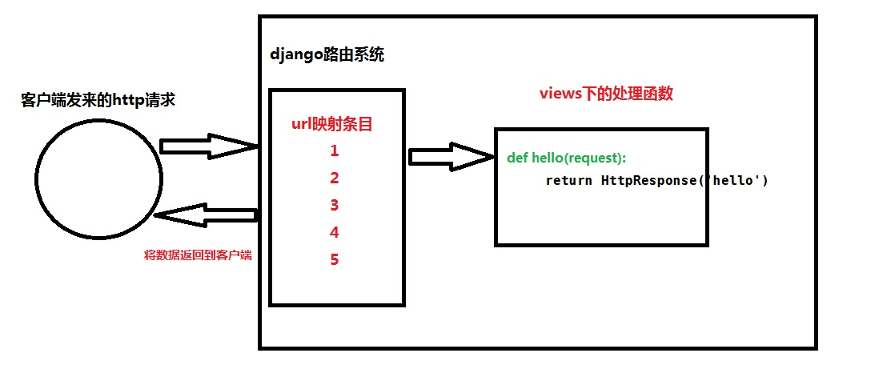

# 路由系统

简而言之，django的路由系统作用就是使views里面处理数据的函数与请求的url建立映射关系。使请求到来之后，根据urls.py里的关系条目，去查找到与请求对应的处理方法，从而返回给客户端http页面数据


django 项目中的url规则定义放在project 的urls.py目录下，
默认如下：

```python
from django.conf.urls import url
from django.contrib import admin

urlpatterns = [
    url(r'^admin/', admin.site.urls),
]
```

url()函数可以传递4个参数，其中2个是必须的：regex和view，以及2个可选的参数：kwargs和name。下面是具体的解释：

- regex：
  regex是正则表达式的通用缩写，它是一种匹配字符串或url地址的语法。Django拿着用户请求的url地址，在urls.py文件中对urlpatterns列表中的每一项条目从头开始进行逐一对比，一旦遇到匹配项，立即执行该条目映射的视图函数或二级路由，其后的条目将不再继续匹配。因此，url路由的编写顺序至关重要！

需要注意的是，regex不会去匹配GET或POST参数或域名，例如对于https://www.example.com/myapp/，regex只尝试匹配myapp/。对于https://www.example.com/myapp/?page=3,regex也只尝试匹配myapp/。

如果你想深入研究正则表达式，可以读一些相关的书籍或专论，但是在Django的实践中，你不需要多高深的正则表达式知识。

性能注释：正则表达式会进行预先编译当URLconf模块加载的时候，因此它的匹配搜索速度非常快，你通常感觉不到。

- view：
  当正则表达式匹配到某个条目时，自动将封装的HttpRequest对象作为第一个参数，正则表达式“捕获”到的值作为第二个参数，传递给该条目指定的视图。如果是简单捕获，那么捕获值将作为一个位置参数进行传递，如果是命名捕获，那么将作为关键字参数进行传递。
- kwargs：
  任意数量的关键字参数可以作为一个字典传递给目标视图。
- name：
  对你的URL进行命名，可以让你能够在Django的任意处，尤其是模板内显式地引用它。相当于给URL取了个全局变量名，你只需要修改这个全局变量的值，在整个Django中引用它的地方也将同样获得改变。这是极为古老、朴素和有用的设计思想，而且这种思想无处不在。

## 1.最基础映射

用户访问http://127.0.0.1:8000/index 然后后端使用index()函数处理

urls.py

```python
from django.conf.urls import include, url
from django.contrib import admin
from app01 import views

urlpatterns = [
    url(r'^admin/', admin.site.urls),
    url(r'^index/$', views.index),
　　]
```

1、先从创建的app下的views.py面定义处理数据的函数

2、在urls.py里导入views

3、在urlpatterns里写入一条url与处理函数的l映射关系

4、url映射一般是一条正则表达式，“^” 字符串的开始，“$“ 字符串的结束

5、当写成\^$不输入任何url时不会在返回黄页，而是返回后面函数里对应的页面。一般这一条会写在url的最后。如

## 2.按照顺序放置的动态路由

可以使用正则来匹配URL，将一组url使用一条映射搞定

```python
urlpatterns = [
     url(r'^host/(\d+)$', views.host),
     url(r'^host_list/(\d+)/(\d+)$', views.host_list), 
]
```

\^host/(\d+)$
相对应的url是： ”<http://127.0.0.1/host/2>“ (\d+)是匹配任意的数字，在分页时灵活运用。
在views.host中需要指定一个形式参数来接受(\d+)\$ 的值

```python
 def user_list(request,id):
     return HttpResponse(id)
```

\^host_list/(\d+)/(\d+)$

相对应的url是： ”<http://127.0.0.1/host/8/9>“，匹配到的数字会以参数的形式按照顺序传递给views里面相对应的函数
在views.host_list中需要指定两个形式参数,注意：此参数的顺序严格按照url中匹配的顺序

```python
 def user_list(request,hid,hid2): 
     return HttpResponse(hid+hid2)
```

## 3.传参形势的路由

利用正则表达式的分组方法，将url以参数的形式传递到函数，可以不按顺序排列

```python
urlpatterns = [ 
     url(r'^user_list/(?P<v1>\d+)/(?P<v2>\d+)$',views.user_list), 
 ]


(?P<v1>\d+)

正则表达式的分组，相当于一个字典， key=v1, value=\d+。 {"v1":"\d+"}
```

然后将此参数传递到views里对应的函数，可以不按照顺序

```python
def user_list(request,v2,v1):
 
     return HttpResponse(v1+v2)
参数v1 = (?P<v1>\d+)

参数v2 = (?P<v2>\d+)
```

## 4.根据不同的app来分发不同的url

如果一个项目下有很多的app，那么在urls.py里面就要写巨多的urls映射关系。这样看起来很不灵活，而且杂乱无章。
我们可以根据不同的app来分类不同的url请求。
首先，在urls.py里写入urls映射条目。注意要导入include方法

```python
from django.conf.urls import include, url
from django.contrib import admin

urlpatterns = [

    url(r'^app01/', include('app01.urls')),
    url(r'^app02/', include('app02.urls')),

]
```

这条关系的意思是将url为”app01/“的请求都交给app01下的urls去处理

其次，在app01下创建一个urls.py文件，用来处理请求的url，使之与views建立映射

```
from django.conf.urls import include, url
from app01 import views

urlpatterns = [

    url(r'index/$', views.index),

]
```

想对于url请求为： "<http://127.0.0.1/app01/index/>"

## 5.通过反射机制，为django开发一套动态的路由系统

在urls.py里定义分类正则表达式

```python
from django.conf.urls import patterns, include, url
from django.contrib import admin
from DynamicRouter.activator import process

urlpatterns = patterns('',
    # Examples:
    # url(r'^$', 'DynamicRouter.views.home', name='home'),
    # url(r'^blog/', include('blog.urls')),

    url(r'^admin/', include(admin.site.urls)),
    
    
    ('^(?P<app>(\w+))/(?P<function>(\w+))/(?P<page>(\d+))/(?P<id>(\d+))/$',process),
    ('^(?P<app>(\w+))/(?P<function>(\w+))/(?P<id>(\d+))/$',process),
    ('^(?P<app>(\w+))/(?P<function>(\w+))/$',process),
    ('^(?P<app>(\w+))/$',process,{'function':'index'}),
)
```

在同目录下创建activater.py

```python
#!/usr/bin/env python
#coding:utf-8

from django.shortcuts import render_to_response,HttpResponse,redirect


def process(request,**kwargs):
    '''接收所有匹配url的请求，根据请求url中的参数，通过反射动态指定view中的方法'''
    
    app =  kwargs.get('app',None)
    function = kwargs.get('function',None)
    
    try:
        appObj = __import__("%s.views" %app)
        viewObj = getattr(appObj, 'views')
        funcObj = getattr(viewObj, function)
        
        #执行view.py中的函数，并获取其返回值
        result = funcObj(request,kwargs)
        
    except (ImportError,AttributeError),e:
        #导入失败时，自定义404错误
        return HttpResponse('404 Not Found')
    except Exception,e:
        #代码执行异常时，自动跳转到指定页面
        return redirect('/app01/index/')
    
    return result
```

## 6.FBV和CBV

所谓FBV和CBV 是指url 和view的对应关系

- FBV function base view /url/ --> 函数
- CBV class base view /url/ -->类

上述都是FBV的方式。下面对CBV进行说明：

- urls.py

```python
url(r'^cbv',views.CBVtest.as_view()),
```

- views.py

```python
class CBVtest(View):
    def dispatch(self, request, *args, **kwargs):
        print("类似装饰器：before")
        result = super(CBVtest, self).dispatch(request, *args, **kwargs)
        print("类似装饰器：after")
        return result

    def get(self, request):  # 定义get方法，get请求执行这个方法
        print(request.method)
        return HttpResponse('cbvget')

    def post(self, request):  # 定义post方法，post请求执行这个方法
        print(request.method)
        return HttpResponse('cbvpost')
```