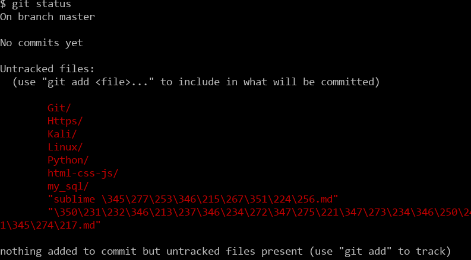
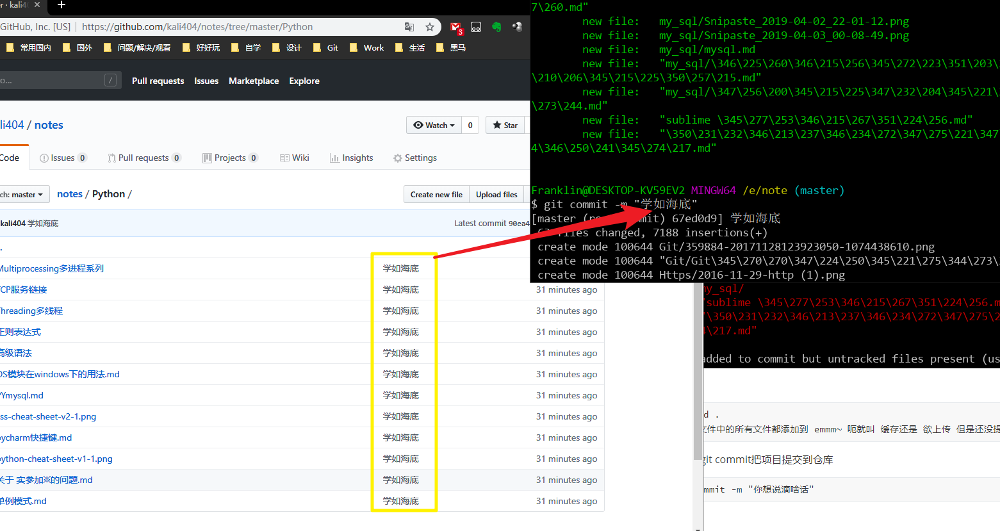
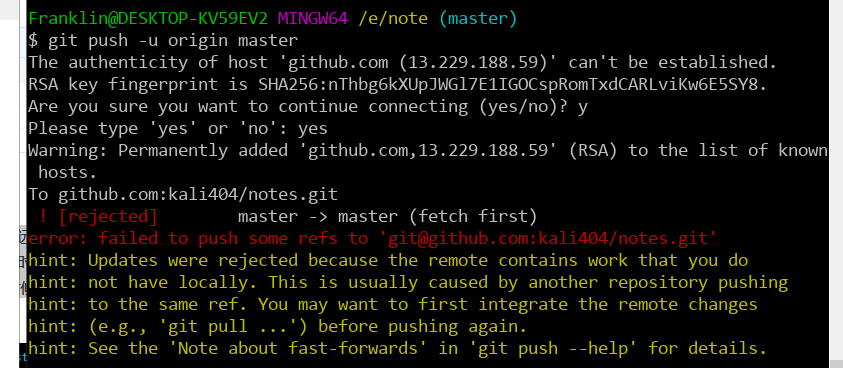

很早之前就注册了Github，但对其使用一直懵懵懂懂，很不熟练，所以今天决定把Git好好学习一遍，好让自己以后能更好地使用Github

安装Git

略...

打开git完事进入你想上传的文件夹(最好是新建文件夹),操作和linux文件操作命令相同

执行

```git
git init
```


完事呢你的文件夹里就会有一个.git文件夹了(ps:别删除它是Git用来跟踪和管理版本库的.如果你看不到,是因为它默认是隐藏文件,那你就需要设置一下让隐藏文件可见

你可以把想上传的文件 CV大法到你`新建文件夹`下面(PPPS:不是.git目录下),文件目录结构如下:


俺们可以先瞅一下

```git
git status  # 来查看你当前的状态
```



然后尼:

```
git add .
# 把这个文件中的所有文件都添加到 emmm~ 呃就叫 缓存还是 欲上传 但是还没提交
```

再然后尼:用git commit把项目提交到仓库

```
git commit -m "你想说滴啥话"
# 看图吧 不写??可能 会出现问题
```



哦对了 你们不都是注册好了帐号了么...

新建个仓库完事


```
git remote add origin https://github.com/kali404/notes.git
```

这就关联了

剩下的就是提交上去:

```
git push -u origin master
# 由于新建的远程仓库是空的，所以要加上-u这个参数，等远程仓库里面有了内容之后，下次再从本地库上传内容的时候只需下面这样就可以了：
git push origin master
```

**完活!!**

------------------------

另外，这里有个坑需要注意一下，就是在上面第七步创建远程仓库的时候，如果你勾选了Initialize this repository with a README(就是创建仓库的时候自动给你创建一个README文件)



呃先合并一下

```
git pull --rebase origin master
# 完事再提交
```

