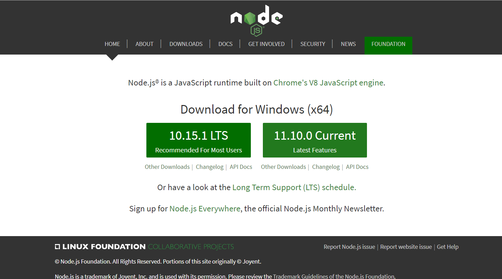
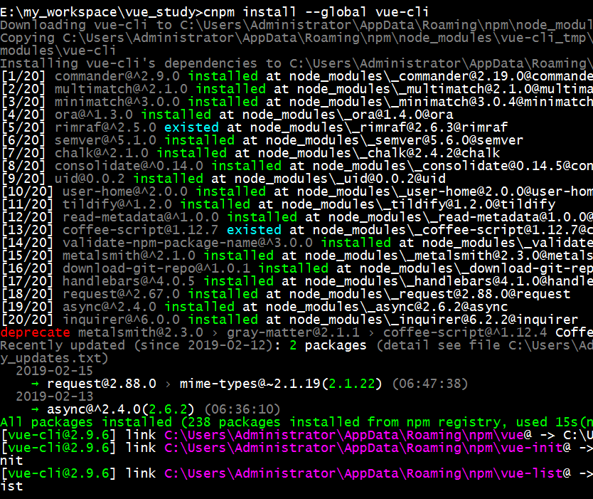
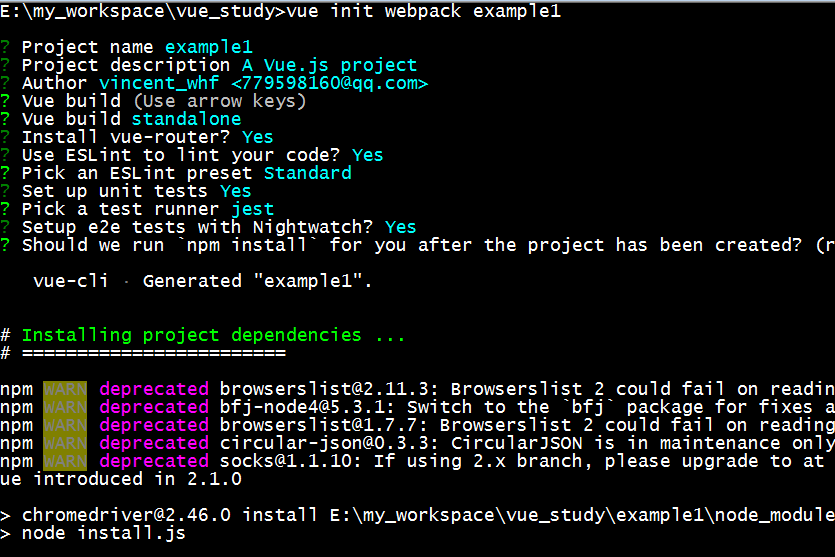
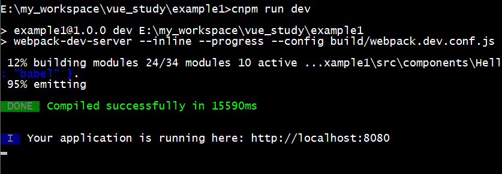
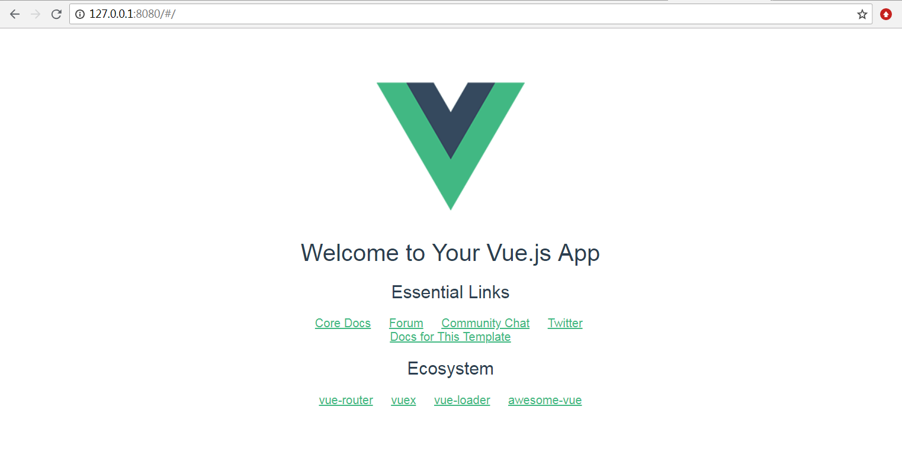
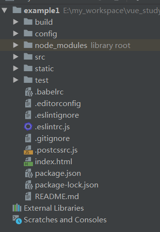

# vue使用操作指南--入门

### 1. vue介绍

&nbsp;&nbsp;&nbsp;&nbsp;&nbsp;&nbsp;&nbsp;&nbsp;Vue (读音 /vjuː/，类似于 view) 是一套用于构建用户界面的<b style="color:red;">渐进式框架</b>。与其它大型框架不同的是，Vue 被设计为可以自底向上逐层应用。Vue 的核心库只关注视图层，不仅易于上手，还便于与第三方库或既有项目整合。另一方面，当与现代化的工具链以及各种支持类库结合使用时，Vue 也完全能够为复杂的单页应用提供驱动。

1）安装node.js

https://nodejs.org/en/

2）测试安装成功与否

命令: node -v

3）检测npm安装成功与否

新版的nodejs已经集成了npm，所以之前npm也一并安装好了。可以通过输入 "npm -v" 来测试是否成功安装。命令如下，出现版本提示表示安装成功:

如果npm版本太旧，可以通过npm命令进行升级，升级命令如下:

	# Linux系统
	sudo npm install npm -g
	
	# Windows系统
	npm install npm -g

### 2. 安装cnpm

1) npm安装命令

npm 的包安装分为本地安装（local）、全局安装（global）两种，从敲的命令行来看，差别只是有没有-g而已，比如

	#升级 npm
	cnpm install npm -g

​	
	# 升级或安装 cnpm
	npm install cnpm -g

由于npm 安装速度慢，因此使用cnpm，cnpm的安装如上命令所示。

2) 检测cnpm安装成功与否

命令: cnpm -v

3) cnpm的使用

卸载模块: cnpm uninstall 包

更新模块: cnpm update 包

搜索模块: cnpm search 包

安装的包存在于: node_modules文件夹下。

### 3. 构建VUE

1）使用cnpm命令安装VUE

	# 最新稳定版
	$ cnpm install vue

2）全局安装vue-cli

3）使用vue进行创建项目
	
	# 创建基于webpack模板的example1项目
	vue init webpack example1

执行该命令创建项目时，需要进行一些选项的配置，直接默认回车即可。且创建项目非常的慢，需要等待一段时间。

安装成功后，提示启动项目命令:

4) 启动项目

安装相关依赖命令:

	cnpm install

执行启动命令:

	cnpm run dev

启动成功后，将默认的开启本地的8080端口，在浏览器中访问localhost:8080或者127.0.0.1:8080即可查看vue的启动首页界面。

注意：Vue.js 不支持 IE8 及其以下 IE 版本。

5）vue项目结构

目录说明:

	build: 项目构建(webpack)相关代码
	config: 配置目录，包括端口号等。我们初学可以使用默认的。
	node_modules: npm 加载的项目依赖模块
	
	src: 开发的目录，基本上要做的事情都在这个目录里。里面包含了几个目录及文件：
	
	assets: 放置一些图片，如logo等。
	components: 目录里面放了一个组件文件，可以不用。
	App.vue: 项目入口文件，我们也可以直接将组件写这里，而不使用 components 目录。
	main.js: 项目的核心文件。
	static: 静态资源目录，如图片、字体等。
	
	test: 初始测试目录，可删除
	.xxxx文件: 这些是一些配置文件，包括语法配置，git配置等。
	index.html: 首页入口文件，你可以添加一些 meta 信息或统计代码啥的。
	package.json: 项目配置文件。
	README.md: 项目的说明文档，markdown 格式