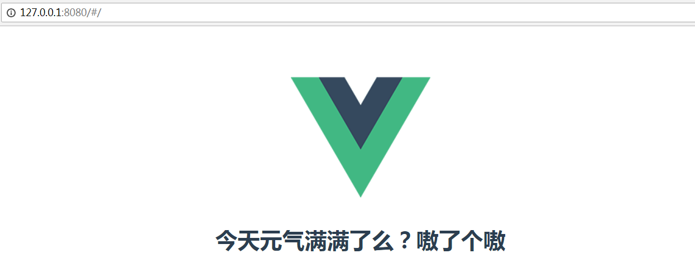

# vue使用操作指南--第一个vue组件

### 1. 项目结构介绍

vue项目结构

vue的src目录是开发者主要编程的地方，如用户编写自定义的组件就需在components文件夹中定义，App.vue文件为项目入口文件（引入自定义的组件）。

### 2. 自定义组件

在components文件夹下创建helloWorld.vue文件，并定义如下内容:
	
	<template>
	    

	        <h1>{{ msg }}</h1>
	    

	</template>
	
	

注意: 

1. 在组件helloWorld.vue文件中定义<template>标签，标签中可以解析变量msg。
2. 在script中定义解析变量msg的值，语法为: data (){return msg: '值'}

### 3. 修改项目启动文件，引入自定义组件helloWorld.vue文件

修改项目启动文件App.vue文件，并引入自定义组件helloWorld.vue。

	<template>
	  

	    
	    <!--<router-view/>-->
		// 将组件中<template>标签中的内容解析在此处。解析的标签<hello>为script中引入的hello
	    <hello></hello>
	  

	</template>
	
	
	
	

注意: 

1. 引入自定义组件，并命名。如: import hello from './components/helloWorld'
2. 加载组件, 如: export default中<b style="color:red;">新增参数components: {hello}</b>

		export default {
		  name: 'App',
		  components: {
		    hello
		  }
		}

3. 解析刚引入的组件hello（ <b style="color:red;">解析的标签<hello>为script中引入的hello</b> ）

### 4. 运行效果图

