# Mysql数据库使用指南

### 前言

#### 什么是数据库？
 数据库（Database）是按照数据结构来组织、存储和管理数据的仓库，

每个数据库都有一个或多个不同的API用于创建，访问，管理，搜索和复制所保存的数据。

我们也可以将数据存储在文件中，但是在文件中读写数据速度相对较慢。

所以，现在我们使用关系型数据库管理系统（RDBMS）来存储和管理的大数据量。所谓的关系型数据库，是建立在关系模型基础上的数据库，借助于集合代数等数学概念和方法来处理数据库中的数据。

RDBMS即关系数据库管理系统(Relational Database Management System)的特点：

    1.数据以表格的形式出现
    2.每行为各种记录名称
    3.每列为记录名称所对应的数据域
    4.许多的行和列组成一张表单
    5.若干的表单组成database

#####  术语

在我们开始学习MySQL 数据库前，让我们先了解下RDBMS的一些术语：

    数据库: 数据库是一些关联表的集合。
    数据表: 表是数据的矩阵。在一个数据库中的表看起来像一个简单的电子表格。
    列: 一列(数据元素) 包含了相同的数据, 例如邮政编码的数据。
    行：一行（=元组，或记录）是一组相关的数据，例如一条用户订阅的数据。
    冗余：存储两倍数据，冗余降低了性能，但提高了数据的安全性。
    主键：主键是唯一的。一个数据表中只能包含一个主键。你可以使用主键来查询数据。
    外键：外键用于关联两个表。
    复合键：复合键（组合键）将多个列作为一个索引键，一般用于复合索引。
    索引：使用索引可快速访问数据库表中的特定信息。索引是对数据库表中一列或多列的值进行排序的一种结构。类似于书籍的目录。
    参照完整性: 参照的完整性要求关系中不允许引用不存在的实体。与实体完整性是关系模型必须满足的完整性约束条件，目的是保证数据的一致性。

####1 .使用Mysql客户端进行连接Mysql的命令

先使用mysql命令连接到mysql的服务器，输入安装的时候自己设置的密码
```
mysql -u root -p
```
然后输入mysql的密码即可进入mysql数据库中

如下就是进入mysql中的图：
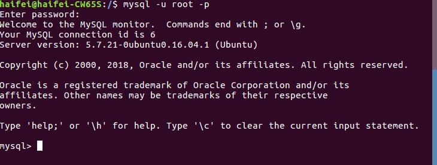

#### 3.简单的SQL命令

##### 3.1查看当前mysql中有那些数据库

```
show databases;
```
如下展示了mysql中已存在的数据库
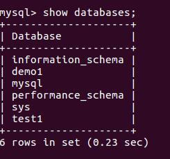


##### 3.2创建/删除自定义的数据库

###### 创建数据库

创建数据库的时候，需要指定编码charset=utf-8,要不然存储中文会出现乱码

```sql
create database test charset=utf8;
```

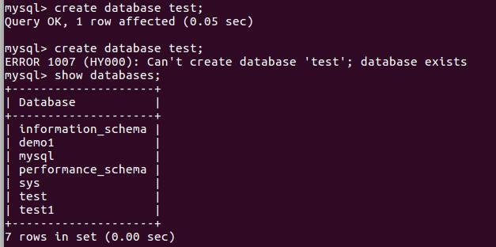


注意：1.  create database 语句的后面是要创建的数据库名称。建议数据库名称尽可能是有意义和具有一定的描述性。

      2. 重复创建同一个数据库是会提示你，数据库已经存在了


改进方案：
```
create database if not exists database_name
```

注意: if not exists是语句的可选子句。 if not exists子句可防止创建数据库服务器中已存在的新数据库的错误。不能在MySQL数据库服务器中具有相同名称的数据库。


###### 删除数据库

```
drop database test;
```

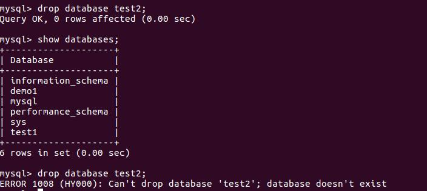

注意：删除重复的同一个数据库的时候是会提醒你，数据库不存在了

改进方案：
```
drop database if exists test;
```
注意：与create database语句类似，if exists是该语句的可选部分，以防止您删除数据库服务器中不存在的数据库。


##### 3.3选择数据库

你连接到 MySQL 数据库后，可能有多个可以操作的数据库，所以你需要选择你要操作的数据库。 必须通过使用USE语句告诉MySQL要使用哪个数据库。
```
use test;
```
从现在开始，所有操作(如查询数据，创建新表, 增加表数据，删除表数据)都将对当前数据库(即test)产生影响。


##### 3.4数据类型

MySQL支持多种类型，大致可以分为三类：数值、日期/时间和字符串(字符)类型。 

数值类型：
<br>
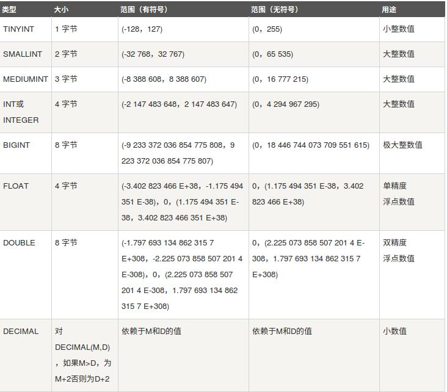

日期和时间类型：
表示时间值的日期和时间类型为DATETIME、DATE、TIMESTAMP、TIME和YEAR。
每个时间类型有一个有效值范围和一个"零"值，当指定不合法的MySQL不能表示的值时使用"零"值。
<br>
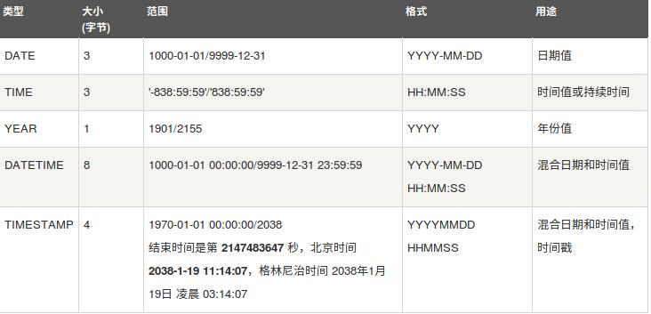

字符串类型：
<br>
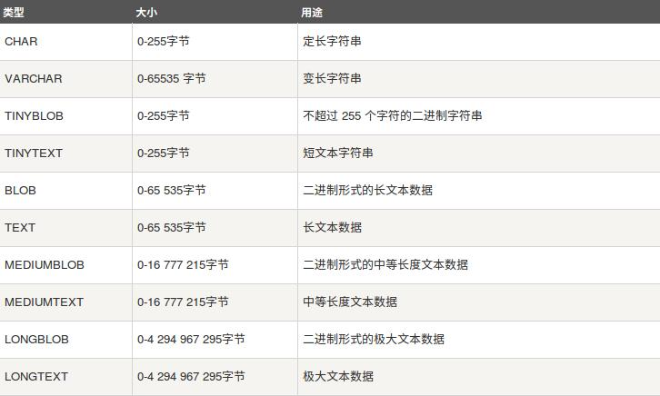


##### 3.5创建表

创建MySQL数据表需要以下信息：

    表名
    表字段名
    定义每个表字段

语法：
    create table table_name (column_name column_type);

```
create table `student`(
 `id` int auto_increment,
 `name` varchar(30) not null,
 primary key(`id`) 
)engine=InnoDB default charset=utf8;
```


解析：
1. 如果你不想字段为空 可以设置字段的属性为 NOT NULL， 在操作数据库时如果输入该字段的数据为NULL ，就会报错。
2. AUTO_INCREMENT定义列为自增的属性，一般用于主键，数值会自动加1。
3. INT 定义的字段为整形
4. VARCHAR 定义可变的字符串，最大的长度为30。
5. PRIMARY KEY关键字用于定义列为主键。
6. ENGINE 设置存储引擎。
7. CHARSET 设置编码。

##### 3.6删除表
删除表的语法很简单，删除表的同时，表里面的所有信息都会被删除掉，所以该操作需要很小心。

语法：
    drop table table_name ;

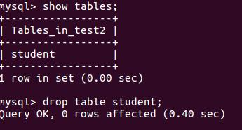

***


##### 3.7增数据
语法：
    inset into table_name (file1, file2, file3) values (value1, value2, value3)

```
insert into `student` (`name`) values('coco');
```
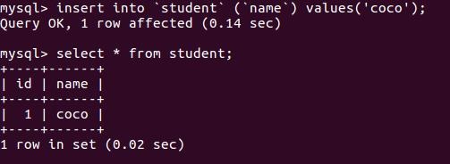


##### 3.8查数据

语法：
    select column_name1, column_name2 
    from table_name
    [where]
    [limit n] [offset m]

注解：

    1）查询语句中你可以使用一个或者多个表，表之间使用逗号(,)分割，并使用WHERE语句来设定查询条件。
    2）SELECT 命令可以读取一条或者多条记录。
    3）可以使用星号（*）来代替其他字段，SELECT语句会返回表的所有字段数据
    4）可以使用 WHERE 语句来包含任何条件。
    5）可以使用 LIMIT 属性来设定返回的记录数。
    6）可以通过OFFSET指定SELECT语句开始查询的数据偏移量。默认情况下偏移量为0。

```
select id,name from student where name='coco';
```
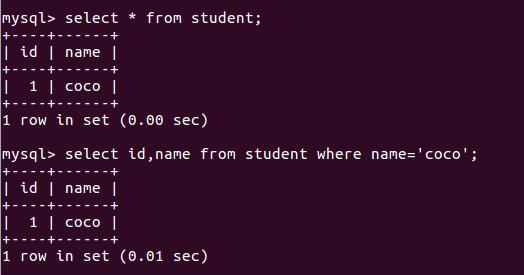

<br>

##### 3.9改数据

语法：
    update table_name set field1=value1 fields2=value2 
    [where]

注解： 
    1) 可以同时更新一个或多个字段。
    2) 可以在 WHERE 子句中指定任何条件。

```
update student set name='xxx' where id=1;
```

<br>


##### 3.10删数据

语法：
    delete from table_name [where]

注解：
    1）如果没有指定 WHERE 子句，MySQL 表中的所有记录将被删除。

```
delete from student where name='xxx';
```
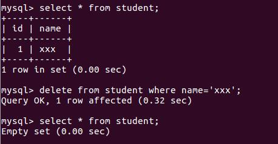


#### 4.进阶

##### 4.1 主键

语法：
    alter table table_name add primary KEY(primary_key_column);

注解：
1）简单而言，主键就是一个用来唯一标识表中的每行记录
2）主键的值必须是唯一的，非空的，每个表只有一个主键
3）主键的数据类型，int 类型
4）主键通常设为 auto_increment，自动生成唯一的序列值


##### 4.2 外键

    一张表中有一个非主键的字段指向了别一张表中的主键，就将该字段叫做外键。

语法：

    alter table table_name1 add [constraint 约束名] foreign key(外键字段名) references table_name2(主键字段名);

使用外键的前提：

　　1. 表储存引擎必须是innodb，否则创建的外键无约束效果。

　　2. 外键的列类型必须与父表的主键类型完全一致。

　　3. 外键的名字不能重复。

　　4. 已经存在数据的字段被设为外键时，必须保证字段中的数据与父表的主键数据对应起来。

 ##### 4.3外键约束
 on delete 和 on update都有restrict，no action, cascade, set Null属性。现在分别对他们的属性含义做个解释。

 1. ON DELETE
    restrict(约束):当在父表（即外键的来源表）中删除对应记录时，首先检查该记录是否有对应外键，如果有则不允许删除。

    no action:意思同restrict.即如果存在从数据，不允许删除主数据。

    cascade(级联):当在父表（即外键的来源表）中删除对应记录时，首先检查该记录是否有对应外键，如果有则也删除外键在子表（即包含外键的表）中的记录。

    set null:当在父表（即外键的来源表）中删除对应记录时，首先检查该记录是否有对应外键，如果有则设置子表中该外键值为null（不过这就要求该外键允许取null）

 2. ON UPDATE
     restrict(约束):当在父表（即外键的来源表）中更新对应记录时，首先检查该记录是否有对应外键，如果有则不允许更新。

     no action:意思同restrict.

     cascade(级联):当在父表（即外键的来源表）中更新对应记录时，首先检查该记录是否有对应外键，如果有则也更新外键在子表（即包含外键的表）中的记录。

     set null:当在父表（即外键的来源表）中更新对应记录时，首先检查该记录是否有对应外键，如果有则设置子表中该外键值为null（不过这就要求该外键允许取null）。

##### 4.4索引


什么是索引：
    MySQL索引的建立对于MySQL的高效运行是很重要的，索引可以大大提高MySQL的检索速度。打个比方，如果合理的设计且使用索引的MySQL是一辆兰博基尼的话，那么没有设计和使用索引的MySQL就是一个人力三轮车。
    实际上，索引也是一张表，该表保存了主键与索引字段，并指向实体表的记录。
但过多的使用索引将会造成滥用。因此索引也会有它的缺点：虽然索引大大提高了查询速度，同时却会降低更新表的速度，如对表进行INSERT、UPDATE和DELETE。因为更新表时，MySQL不仅要保存数据，还要保存一下索引文件。


创建语法：
    create index [index_name索引名] on table_name([column_name 列名]);


删除语法：
    drop index [index_name 索引名] on table_name;


查看语法：
   show index from table_name;

修改语法：
  alter table table_name add unique [index_name 索引名]

##### 4.4聚合函数

什么是聚合函数：
   对统计的结果进行二次筛选：分组，排序，算和，计算最大值，最小值，求取平均值等

   1）group by 字段 ：
    按字段将记录分组，通常和其它的函数联合使用，group by 操作后，返回每一组的第一条记录

   2）order by:根据指定字段进行排序，默认升序(asc)排序，可以指定多个排序字段，按照字段先后分别排序。

   3）sum(expr):求和

   4）avg(expr):求平均数

   5）count(expr):计数器，返回SELECT语句检索到的行中非NULL值的数目

   6）max(expr) 获取最大值

   7）min(expr) 获取最小值


#### 5. 其他查询方法

##### 5.1 介于什么之间

关键字：between  and 
作用：用来查询过滤信息，在一个范围内的搜素结果。

##### 5.2 模糊查询
1）关键字： like
作用：用来模糊查询

例如： 查询学生表中姓王的同学
```
select stuname, stusex from TbStudent where stuname like '王%';
```
例如： 查询学生表中姓名中有王字的同学
```
select stuname from TbStudent where stuname like '%王%';
```
2）关键字： _
作用：用来模糊查询，但是只能有一个模糊查询的位数

例如：查询姓郭名字总共两个字的学生的姓名(模糊)
```
select stuname from TbStudent where stuname like '郭_';
```

例如：查询姓郭名字总共三个字的学生的姓名(模糊)
```
select stuname from TbStudent where stuname like '郭__';
```

##### 5.3 去重

关键词： distinct
作用：去除重复性的数据

例如：所有学生中语文成绩（去重）
```
select distinct s_yuwen from TbStudent;
```

##### 5.4 判断

关键词：if(字段,exp1,exp2) 或者 ifnull(字段,exp1,,exp2)
作用：if表达式中如果字段值为真则返回exp1的值，如果为假的话，返回exp2的值
     ifnull表达式中如果字段的值为假则返回exp1的值，如果为假的话，返回exp2的值

例如： 查询男女学生的人数(分组和聚合函数)
```
select if(stusex, '男', '女') as `性别`, count(stusex) as `人数` from TbStudent group by stusex;
```

##### 5.5 分组聚合

关键词： group by having
作用：
    HAVING语句通常与GROUP BY语句联合使用，用来过滤由GROUP BY语句返回的记录集。
    HAVING语句的存在弥补了WHERE关键字不能与聚合函数联合使用的不足

例如：查询平均成绩大于等于90分的学生的学号和平均成绩
```
select sid as `学号`, avg(score) as `平均成绩` from TbSC group by sid having avg(score)>=90;
```

##### 5.6关联

定义  A INNER/LEFT/RIGHT JOIN B操作中，A表被称为左表，B表被称为右表。

a) 内关联： Inner Join on
作用：仅对满足连接条件的列进行关联，其中inner可省略

b) 左外连接：Left Outer Jion on
作用：其中outer可以省略。如A LEFT JOIN B，会输出左表A中所有的数据，同时将符合ON条件的右表B中搜索出来的结果合并到左表A表中，如果A表中存在而在B表中不存在，则结果集中会将查询的B表字段值（如此处的P.PUNISHMENT字段）设置为NULL。
所以，LEFT JOIN的作用是：
LEFT JOIN：从右表B中将符合ON条件的结果查询出来，合并到A表中，再作为一个结果集输出。

c) 右外连接：Right Outer Jion on
作用：其中outer可以省略，而RIGHT JOIN刚好相反，“A RIGHT JOIN B ON ……”是将符合ON条件的A表搜索结果合并到B表中，作为一个结果集输出：

