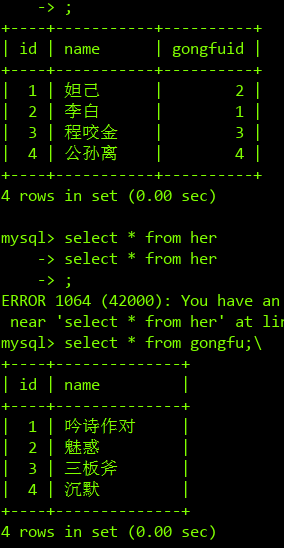

# MYSQL数据库

------

## 数据库操作
-------
### 连接数据库

```shell
mysql -u用户名 -p
mysql -h127.0.0.1 -uroot -p123456
# -h放的是链接地址
```

### 显示时间

```sql
select now();
```
### 查看数据库

```sql
show databases;  # 查看所有数据库
```

### 创建数据库

```sql
create database 数据库名 charset=utf8;
create database python charset=utf8;
```
### 删除数据库

```sql
drop database 数据库名;
```
### 查看正在使用的数据库

```sql
select database();
```


### 使用;切换数据库

```sql
use 数据库名;
```

### 查看所有表

```sql
show tables;
```

#### 查看结构

```sql
desc 表名
```


## 表操作

### 查看所有表

```sql
show tables;
```

### 创建表头

```sql
create table students(
	id int unsigned primmary key auto_increment not null,
    name varchar(20) not null,
    age tinyint unsigned default 0,
    height decimal(5,2),
    gender enum('男','女','保密'),
);
```
### 修改表头

```sql
alter table 表名字 add/modify/change 列名 类型 约束;
```

> 修改 modify 可以修改类型和约束
>
> change 可以修改 列名类型和约束

### 删除表头(列

```sql
alter table 表名字 drop 列名字;
```

### 删除表

```sql
drop table student;
--

```
## 数据字段操作

### 插入数据

```sql
insert into student values(null,'aa','男','1988-10-2','......');
insert into student values(null,'bb','女','1889-03-6','......');
insert into student values(null,'cc','男','1889-08-8','......');
insert into student values(null,'dd','女','1889-12-8','......');
insert into student values(null,'ee','女','1889-09-6','......');
insert into student values(null,'ff','null','1889-09-6','......');
```
### 查询表中的数据
```sql
select * from student;
select id,name from student;
```
### 修改某一条数据
```sql
update student set sex='男' where id=4;
```
### 删除数据
```sql
delete from student where id=5;
```

## as && distinct

### as关键字

#### 1.使用as给列名起一个别名

```失去了\
select 列名 as '你想显示的列名', 列名2 as '想显示的列名2' from 表名;
```

#### 2.给表起一个别名

```sql
select 表名.表头,表名.表头 from 表名;
#古老写法
select 表别名.表头,表别名.表头2 from 原表名 as 表别名;
# 通常写法
select 表头(列),表头2,表头3 from 表名;
# 单一表格查询,则可以省略
```

### distinct关键字

#### 去除重复行

```sqlsql
select distinct 表头,表头2 from 表名;
#只能有出现过的 重复的 将不显示
# 例:查性别
select name,gender from students;
# 看到了很多重复的数据 想要对其中的重复的数据进行的去重操作可以使用distinct
```

## where条件的查询

```sql
-- =;>;<;>=;<=;!=;<>;关系运算符
-- 查询 编号大于3的 数据
select * from 表名 where id > 3;
-- 查询 姓名不是黄蓉的学生
select * form 表名 where name != '黄蓉';
-- and or not,逻辑运算符,
-- 查询 编号大于4 的女同学
select * from 表名 where id > 4 and gender=0;
-- 
```

## 模糊匹配

### like

```sql
select * from kke where gender like '%男';
-- %匹配 任意多个字符
mysql> select * from kke where name like '%大%';
+----+-----------------+------+--------+-----------+-------
| id | name            | age  | height | gender    | shenfen 
+----+-----------------+------+--------+-----------+------
|  1 | 普京大弟弟        |   45 | 182.32 | 不是男    | 130xxx18770625xxx
|  9 | 大人物           |   52 | 175.00 | 不是男    | xxx                +----+-----------------+------+--------+-----------+-----

-- _ 匹配一个任意字符

```

### between

```sql
-- between 上限 and 下限;
-- 先写小的 再写大的
--  是连续的
mysql> select * from kke where height between 160 and 180;

```

### in 连续的

```sql
-- 判断在 集合里边的
-- 不是连续的
```

### 判空

```sql
-- is null
mysql> select * from kke where usename is not null;
-- in not null
mysql> select * from kke where usename is null;
-- 过滤表中的记录
```

## 排序

### order by

```sql
-- order by 默认升序
-- 升序ASC|降序DESC
mysql> select * from kke order by height desc;
-- 需要用到多个字段: 如果第一个字段数据相等,就按第二个字段,后续字段进行排序
-- order by 字段名 排序方式,字段2 排序方式...
mysql> select * from kke order by shenfen,id desc;

```

## 分页显示

### limit

```sql
limit 数据下表 = 30,数量
limit 30 -- 默认下标从 '0' 开始 显示数量30个
select * from kke limit 2,3;
mysql> select * from kke order by id DESC limit 3;

```

## 聚合函数

> 对一组数据进行聚合统计,从而获得一个数据

### 求和

```sql
-- sleect sum(age) from 表名;

```

### 统计

```sql
select count(age) from 表名;
-- 默认对空 (null)不 进行 统计
select count(*) from 表名;
-- 一般对 行数 进行统计
```

### 平均数

```sql
select avg(height) from 表名;
```

### 最大值

```
select max(height) from 表名字;
```

### 最小值

```sql
select min(age) from 表名;
```

### ifnull

> ifnull(参数1,参数2) 判断是否为空,如果为空返回参数2,如果参数不为空,返回参数1

## 分组

根据 1个或多个字段将整个数据 分到不同的组中 对每个组进行统计

分组结果的结构 和 表数据结构不一样所以无法直接显示 需要用到`group_concat`

```sql
select genader from studends group by gender;
-- 只是将通过gender 的值和数据相等的组合在一起 并把 组合完成的数据输出
-- 不能添加其他列输出了,如果有输出的项目需要加group_concat()
select gerden,group_concat(name) from studends group by gender;
-- 还是通过 gender 来分组的,输出分组的 gender 以及组合的 name,
-- 多组合 
select gerden,group_concat(name),group_concat(age) from students group by gender;
```

### group by和聚合函数的用法

```sql
-- 需要注意的是 次方法聚合的将是每个分组的 聚合 不再是整个表文件
select gender,avg(age) from students group by gender;
```

### group by 和 with rollup使用

with rollup 的作用是: 在最后记录后面新增一行,显示select 查询时聚合函数的统计和计算结果

```sql
select gender,count(*) from students group by gender with rollup;
-- 根据gender 字段进行分组,汇总人数
```

## 连接查询

> 连接查询可以实现多个表查询,当查询的字段数据来自不同的表就可以使用连接查询来完成

```sql
mysql> select * from hero;
+----+-----------+----------+
| id | name      | gongfuid |
+----+-----------+----------+
|  1 | 妲己      |        2 |
|  2 | 李白      |        1 |
|  3 | 程咬金    |        3 |
|  4 | 公孙离    |        5 |
+----+-----------+----------+
mysql> select * from gongfu;
+----+--------------+
| id | name         |
+----+--------------+
|  1 | 吟诗作对      |
|  2 | 魅惑         |
|  3 | 三板斧       |
|  4 | 沉默         |
+----+--------------+
```


#### 内连接查询

```sql
mysql> select * from hero inner join gongfu;
mysql> select hero.name,gongfu.name from hero inner join gongfu;
-- select 字段 from 表1 inner join 表2 on 表1.字段 = 表2.字段;

mysql> select * from hero inner join gongfu on hero.gongfuid = gongfu.id;

```

#### 左连接查询


```sql
-- select 字段 from 表1 left join 表2 on 表1.字段1 = 表2.字段2
mysql> select * from hero left join gongfu on hero.gongfuid = gongfu.id;

```

#### 右连接查询


```sql
-- select 字段 from 表1 right join 表2 on 表1.字段1 = 表2.字段2
mysql> select * from hero right join gongfu on hero.gongfuid = gongfu.id;
```

#### 自连接查询


```sql
mysql> select a.id,a.title,p.title,p.pid from areas as a inner join areas as p  on a.pid = p.id where p.title = '北京市';
-- 个人理解 是 a拼p 所以 a的pid = p的id
```

## 子查询

### 标量

```sql
--返回一个结果
select avg(height) from kke;
select * from kke where height > (select avg(height) from kke);
-- 将一个子查询写进著查询语句
```

### 行

```sql
 -- 求出班级中 身高最高的 并且 年龄是最大的 注意:这里两个数必须是整个表格中最大的
 select * from kke where (age,height) = (select max(age),max(height) from kke);
 -- 类似与解包 子查询 有两个值 
```

### 列



```sql
-- 求出 多 表格中一列数据
select id from hero;
-- 子查询语句
select * from hero where gongfuid in (select id from gongfu);
```

### 表-多行多列

## 数据库设计

### 范式设计

> ​	1NF 一个字段存储一个数据
>
> ​	2NF=1NF + 表中有主键 + 表中非主键字段必须完全依赖于主键(不能出现部分依赖)。
>
> ​	3NF=2NF + 非主键字段必须直接依赖于主键字段(不能出现传递依赖-非主键依赖非主键)

### E-R图

> ​	矩形  实体 		对应   ==表==
>
> ​	菱形 关系                   ==中间关系表==(实体实体之间==多对多==关系需要转化为中间关系表)
>
> ​	椭圆 属性                   表中一个==字段==
>
> ​	直线 联系	
>
> 

## 添加外联约束

> 作用: 
>
> 子表： 引用主表字段中数据的表
>
> 主表: 提供数据给别表使用的,当对子表中外键字段数据进行更新时 要求新值必须在主表对应字段中存在
>
> 不存在则 更新失败

```sql
-- 表已经存在添加主键约束
-- *^*两个表的类型和约束类型 必须完全相同*^*
--alter table 表名 add foreign key(字段名) references 主表名(主表字段)；
mysql> alter table hero add foreign key(gongfuid) references gongfu(id);
-- 创建表同时添加外键约束
create table haha(
  	字段名 类型 约束,
    ....,
    foreign key (字段名) references 主表名(主表字段)
);
-- 查看外键约束
show create table hero; 
 --删除外键约束 知道外键约束的名字
-- alter table 表名 drop foreign key 外键约束名;
mysql> alter table hero drop foreign key hero_ibfk_1;

```

## qsl 演练

```sql
create table good_cates(
    id int not null primary key auto_increment, 
    name varchar(50) not null
);
-- 将 select 结果插入表中
insert into good_cates(name) select cate_name from goods group by cate_name;

-- 在创建表的同时 插入来自 select 语句的数据 需要将结果中的字段名和表中字段名 起一样的名字
create table good_brands (      
   	id int unsigned primary key auto_increment,      
   name varchar(40) not null) 
   select brand_name as name from goods group by brand_name;

-- 连表更新    在连接过程中 使用一个标的字段值 去修改另外一个表中字段的值
update 表名
	set 字段名=值 
	where 条件;

-- goods join good_cates on goods.cate_name = good_cates.name当做一个虚表
update  goods join good_cates on goods.cate_name = good_cates.name
   set goods.cate_name = good_cates.id;
   
update goods join good_brands on goods.brand_name = good_brands.name
	set goods.brand_name = good_brands.id;

mysql> alter table goods change cate_name cate_id int unsigned not null,
    -> change brand_name brand_id int unsigned not null;
```

