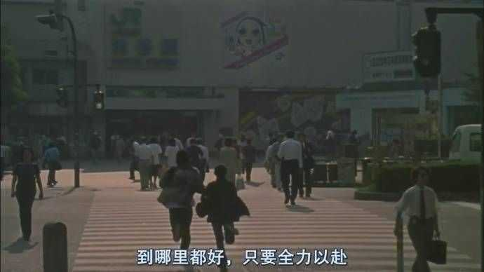

他们都假装颓废，你别上当。

**每一个想要学习的念头，都有可能是未来的你在向你求救。**

要有最朴素的生活和最遥远的梦想，即使明天天寒地冻，路远马亡。

**你继续差吧，我不等你了。**

放弃不难，但坚持一定很酷。

努力尽今夕，少年犹可夸。

你见过母亲羡慕别人的眼神吗？

**半山腰太挤了，你得去山顶看看。**

别在最好的年纪辜负最好的自己。

没有伞的孩子必须奔跑。

纵有疾风，我不言弃。

**你一定要走，走到灯火通明。**

先努力让自己发光，你爱的人才能迎光而来。

坦白说，大城市就是这么现实：只尊重成功。成功就好，没人管你是不是单身，结过几次婚，有没有小孩。实力才是个人最好的注解，其它你随意。无须害怕暴露你的伤痕，只要够努力，你总会为自己赢来尊严、荣誉和更好的人生。所以大城市的冷漠，有时恰恰就是给了每个特定的人，别样的温柔。

堕落不是今天多吃一块蛋糕多喝一杯可乐，也不是出门不化精致的妆穿好看的小裙子，更不是晚上没有用神仙水蒸脸仪，堕落是你不能学会爱自己。值得被爱的不是节食到胃痛瘦出的小蛮腰，不是牺牲一两个小时睡眠化出的妆面，更不是穿着无法行动的恨天高和紧身裙。爱美不是坏事，但为了美丽牺牲快乐与健康是坏事。让人嫌弃的是自卑自负愚蠢，让人喜欢的是自信礼貌渊博。爱美没有错，可如果有人因为你腰不够细腿不够长而歧视、攻击你，是他混蛋，你没有错。