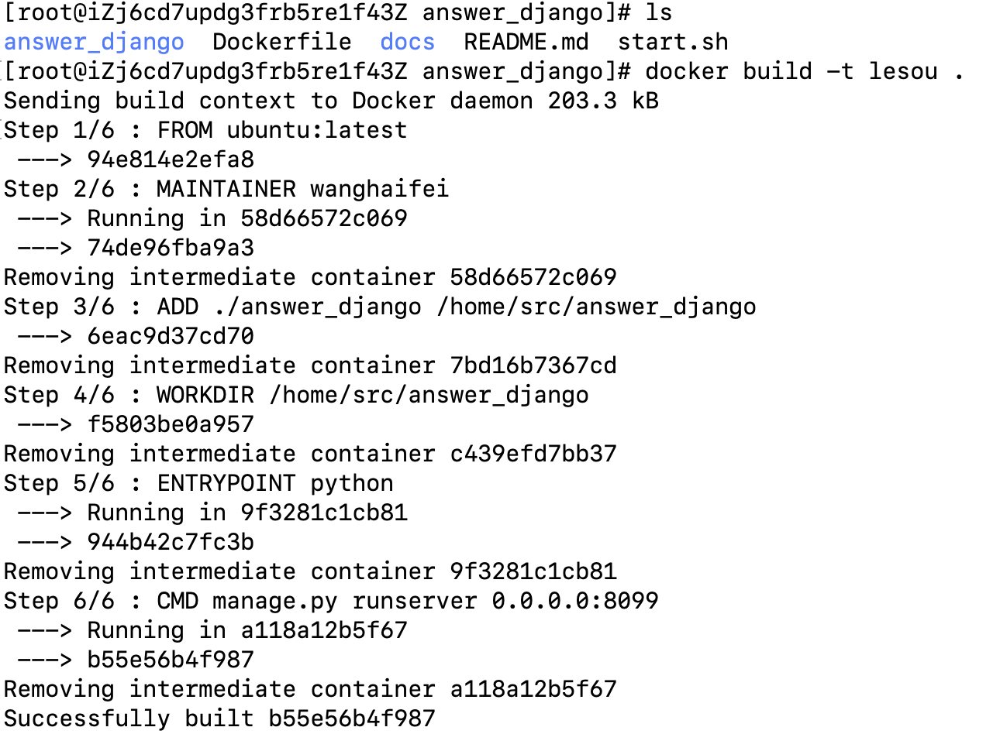
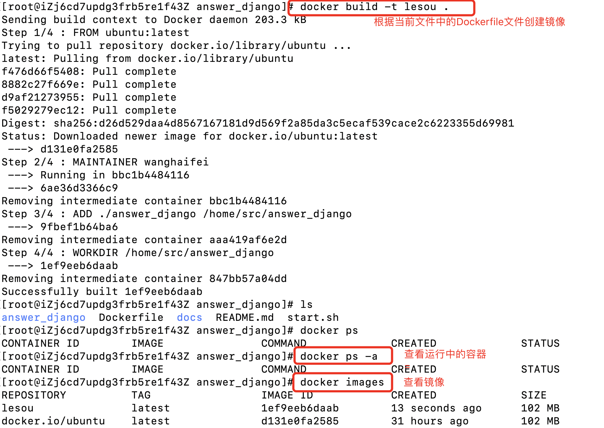

# DOCKER使用指南

### 1. Dockerfile文件

创建Dockerfile文件，其中可以指定如下内容：

```
# 指定基础镜像文件
FROM ubuntu:latest

# 指定维护者信息
MAINTAINER wanghaifei

# 将代码copy到容器中。如 ADD ./blog /blog 表示将和dockerfile文件同级的blog代码copy到容器的根路径/blog中
ADD 和dockerfile文件相对的项目地址 拷贝到容器中的项目地址

# 指定工作目录
WORKDIR /blog

# 复制
COPY 地址  新地址

# 执行更新命令
RUN apt update
# 创建项目地址的日志文件或者媒体文件等
RUN mkdir -p /日志logs地址
RUN mkdir -p /媒体media地址

# 在容器启动时执行命令
ENTRYPOINT ["python"]
CMD ["manage.py", "runserver", "0.0.0.0:8000"]
```

**注意**：

**FROM**指令，Docker编译程序能够知道通过哪个基础镜像来执行并编译项目。所有的Dockerfile都必须以FROM指令开始。通过该指令，我们相当于有了一个最新版本的基本Ubuntu系统。

**RUN** 指令用来在Docker的编译环境中运行指定命令

**WORKDIR** /blog 可以将工作目录定位到/blog 目录下

**ENTRYPOINT** 用于标明一个镜像作为容器运行时，最后要执行的程序或命令。且每个Dockerfile文件只能有一条ENTRYPOINT命令。

**CMD**指令，每个Dockerfile只能有一条CMD指令，如果指定了多条指令，则最后一条执行。

### 2.使用Dockerfile文件构建镜像

进入Dockerfile所在目录，运行命令 `docker build -t 镜像名` . **(注意最后有个点用来表示当前目录，初次构建速度会比较慢，需要多等一会。)** 

启动如下图所示：



### 3.根据镜像创建容器

#### 1) 定义Dockerfile文件

```
FROM ubuntu:latest

MAINTAINER wanghaifei

ADD ./answer_django /home/src/answer_django
WORKDIR /home/src/answer_django
```

**注意：**该文件表示将与Dockerfile同级的answer_django代码添加到镜像的/home/src/下，并以/home/src/answer_django目录作为工作目录。

#### 2) 通过命令‘docker build -t 镜像名 . ’命令将创建镜像，如下创建lesou镜像

创建命令： docker build -t 镜像名 .



**注意：** 需进入定义Dockerfile目录才能执行创建镜像的命令

#### 3) 通过镜像创建容器，如下创建lesouenv容器

创建命令： docker run --name 容器名 -it 镜像名 /bin/bash


